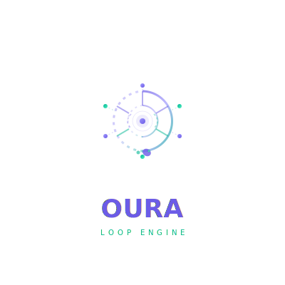
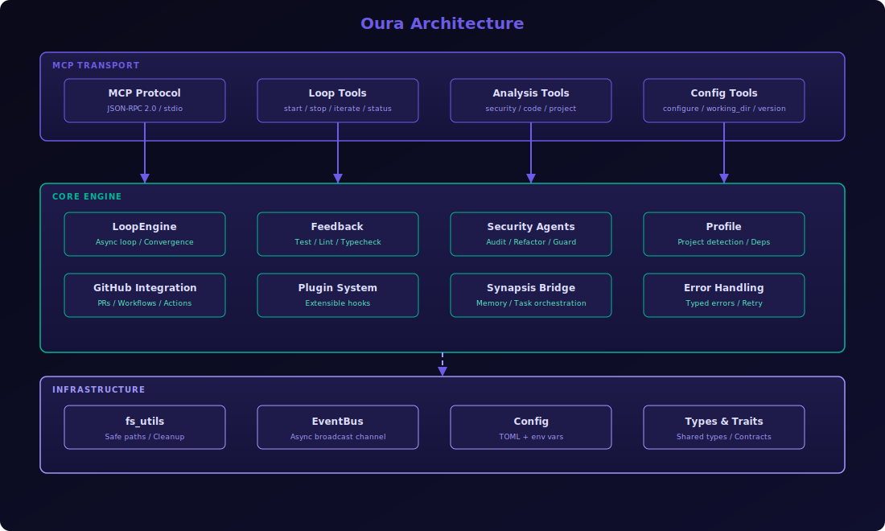

<p align="center">
  
</p>

<h1 align="center">Oura — Loop Engine</h1>

<p align="center">
  <b>Oura</b> (Ouroboros) es un servidor MCP para iteración inteligente automatizada.
  <br>
  La serpiente que refina código a través de ciclos infinitos de mejora.
</p>

<p align="center">
  <a href="https://github.com/MethodWhite/oura/releases"></a>
  <a href="#"></a>
  <a href="LICENSE"></a>
  <a href="#"></a>
  <a href="#"></a>
</p>

## Características

- **Loop Engine**: iteraciones automáticas con detección de convergencia
- **Feedback multi-fuente**: tests, lint, typecheck, custom
- **Sub-agentes**: Security Auditor, Refactor Engine, Anti-deletion Guard, Code Optimizer
- **Integración GitHub**: PRs, workflows, actions, auto-commit, multi-repo
- **Plugin system**: hooks extensibles para eventos del loop
- **Synapsis bridge**: persistencia en Synapsis memory + task orchestration
- **Config**: TOML + env vars (`OURA_*`)

## Arquitectura

<p align="center">
  
</p>

Oura está compuesto por **14 módulos** organizados en capas:

| Capa | Módulos | Responsabilidad |
|------|---------|-----------------|
| **Transporte** | `mcp/mod.rs` | Protocolo JSON-RPC 2.0 sobre stdio |
| **Dispatch** | `mcp/handlers.rs`, `mcp/resources.rs` | Enrutamiento de 20 herramientas MCP |
| **Motor** | `engine.rs`, `feedback.rs` | Bucle de iteración con detección de convergencia |
| **Análisis** | `agents.rs`, `profile.rs` | Seguridad, refactor, perfil de proyecto |
| **Utilidades** | `fs_utils.rs`, `config.rs`, `events.rs`, `error.rs`, `types.rs`, `traits.rs` | Soporte: paths seguros, config, eventos, tipos |

## Instalación

```bash
cargo install --path .
```

O descarga el binario de [releases](https://github.com/MethodWhite/oura/releases).

## Configuración

```bash
# Iniciar config por defecto
oura --init

# O usar env vars
export OURA_GITHUB_TOKEN=ghp_xxx
export OURA_GITHUB_OWNER=MethodWhite
export OURA_GITHUB_REPO=my-project
export OURA_MAX_ITERATIONS=50
```

### Config file (`~/.config/oura/config.toml`)

```toml
[loop_engine]
max_iterations = 20
convergence_threshold = 90.0
feedback_sources = ["test", "lint"]

[github]
enabled = true
default_owner = "MethodWhite"
default_repo = "my-project"
auto_commit = true
auto_pr = true

[synapsis]
enabled = true
endpoint = "http://localhost:7438"
```

## Uso con MCP

Añade a `opencode.json` / `claude-code.json` / `cursor.json`:

```json
{
  "mcpServers": {
    "oura": {
      "type": "stdio",
      "command": "/path/to/oura"
    }
  }
}
```

### Herramientas MCP (20)

| Tool | Descripción |
|------|-------------|
| `oura_start_loop` | Inicia loop de iteración con goal |
| `oura_iterate` | Ejecuta un paso manual |
| `oura_loop_status` | Estado del loop actual |
| `oura_loop_stop` | Detiene el loop |
| `oura_results` | Resultados acumulados |
| `oura_configure` | Actualiza configuración (maxIterations, threshold, workingDirectory) |
| `oura_working_dir` | Cambia el directorio de trabajo |
| `oura_plugin_load` | Carga un plugin |
| `oura_plugin_list` | Lista plugins cargados |
| `oura_analyze_security` | Auditoría de seguridad (9 patrones) |
| `oura_analyze_code` | Análisis de clean code |
| `oura_analyze_project` | Escanea estructura del proyecto |
| `oura_check_integrity` | Verifica integridad de símbolos |
| `oura_guard_destructive` | Protege contra operaciones destructivas |
| `oura_cleanup` | Limpia artefactos temporales |
| `oura_version` | Versión e información de build |
| `oura_update` | Actualiza Oura desde git + cargo build |
| `oura_profile` | Detecta perfil del proyecto |
| `oura_verify` | Verifica licencias y dependencias |
| `mcp_call` | Llama a tools de otros servidores MCP |

## Calidad

| Métrica | Valor |
|---------|-------|
| Tests | 58 pasando |
| Cobertura clippy | 0 warnings |
| `unwrap()` en producción | 0 |
| Deuda técnica corregida | ~55 issues |
| Lenguaje | Rust 1.86+ |
| Licencia | MIT |

## Licencia

MIT — ver [LICENSE](LICENSE).

---

<p align="center">
  Hecho con 🐍 por <a href="https://github.com/MethodWhite">MethodWhite</a>
</p>
